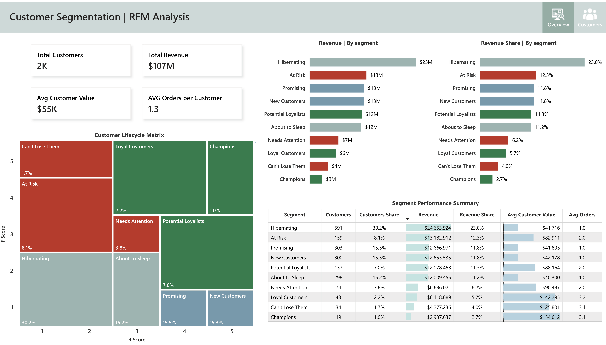
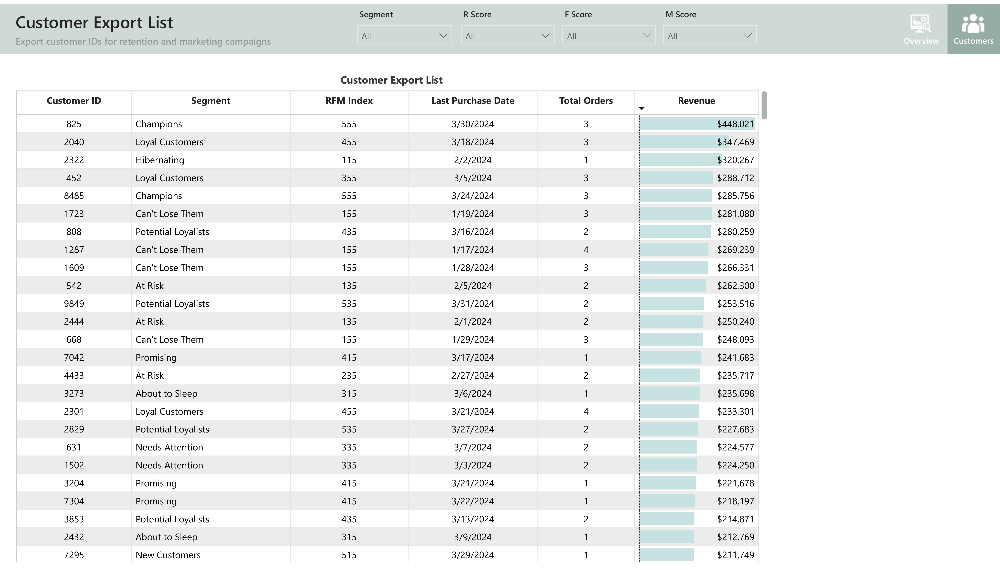

# 📊 Customer Segmentation & RFM Analysis Dashboard

<br>

## 📌 Project Overview

This project focuses on customer behavior analysis using the RFM (Recency, Frequency, Monetary) segmentation methodology.  
The goal was to build an end-to-end analytical solution that combines SQL-based data preparation with an interactive Power BI dashboard for customer lifecycle analysis and marketing operations.

The project includes:
- customer-level RFM segmentation in PostgreSQL
- behavioral customer classification
- interactive Power BI dashboards
- operational customer export functionality for CRM and retention campaigns

<br>

# 🎯 Business Goal

The main objective of this project was to identify customer behavior patterns and segment customers based on purchasing activity.

The solution helps businesses:
- identify high-value customers
- detect customers at churn risk
- analyze customer lifecycle stages
- support retention and reactivation campaigns
- export customer lists for marketing operations

<br>

# 🗂️ Dataset

The analysis was performed on a multi-category e-commerce marketplace dataset.

The dataset contains:
- customer orders
- payments
- product information
- order timestamps
- order statuses

Only delivered orders were included in the analysis.

<br>

# 🛠️ Tech Stack

- PostgreSQL
- SQL
- Power BI
- DAX

<br>

# ⚙️ Data Preparation

Customer-level metrics were calculated in PostgreSQL using Common Table Expressions (CTEs), aggregations, and window functions.

Main preparation steps:
1. Aggregate customer purchase history
2. Calculate RFM metrics
3. Assign RFM scores
4. Generate customer segments
5. Build a final analytical view for Power BI

<br>

# 🧠 RFM Methodology

Customers were segmented using three behavioral dimensions:

| Metric | Description |
|---|---|
| Recency | Days since last purchase |
| Frequency | Number of completed orders |
| Monetary | Total customer revenue |

<br>

## 📈 Scoring Logic

### 🔹 Recency Score
Calculated using `NTILE(5)` based on recency values.

### 🔹 Frequency Score
Frequency scoring was customized to better fit the dataset distribution:

| Orders | F Score |
|---|---|
| 1 order | 1 |
| 2 orders | 3 |
| 3+ orders | 5 |

### 🔹 Monetary Score
Calculated using `NTILE(5)` based on customer revenue.

<br>

# 👥 Customer Segments

Customers were grouped into behavioral segments based on R and F scores.

| Segment | Description |
|---|---|
| Champions | Most valuable and active customers |
| Loyal Customers | Frequent repeat customers |
| Potential Loyalists | Customers with strong retention potential |
| New Customers | Recently acquired customers |
| Promising | New customers with moderate activity |
| Needs Attention | Customers showing reduced engagement |
| About to Sleep | Customers becoming inactive |
| At Risk | Previously active customers with declining activity |
| Can't Lose Them | High-value customers at churn risk |
| Hibernating | Low activity and low engagement customers |

<br>

# 🧱 SQL Pipeline

The final analytical dataset was created as a PostgreSQL view:

```sql
CREATE OR REPLACE VIEW public.v_rfm_segmentation AS
```

The pipeline performs:
- customer aggregation
- RFM metric calculation
- score assignment
- segment classification

The final view was connected directly to Power BI for visualization.

<br>

# 📊 Dashboard Overview

The Power BI solution consists of two pages:

<br>

## 🟩 1. Customer Segmentation Dashboard

Main analytical dashboard containing:
- KPI cards
- Customer Lifecycle Matrix
- Revenue distribution by segment
- Revenue share analysis
- Segment performance summary

### 📌 Key KPIs
- Total Customers
- Total Revenue
- Average Customer Value
- Average Orders per Customer

### 📌 Customer Lifecycle Matrix
The matrix visualizes customer distribution across Recency and Frequency dimensions and highlights behavioral customer groups.



<br>

## 🟦 2. Customer Export List

Operational dashboard designed for CRM and retention workflows.

Features:
- interactive filtering
- customer-level segmentation
- export-ready customer lists
- revenue prioritization

This page allows marketing teams to identify and export target customers for campaigns and retention activities.



<br>

# 🔍 Key Insights

## 1️⃣ Hibernating Customers Represent the Largest Segment
A significant share of customers belong to the Hibernating segment, indicating weak long-term retention and customer inactivity.

## 2️⃣ Champions Generate High Customer Value
Although Champions represent a relatively small percentage of customers, they generate exceptionally high average customer value.

## 3️⃣ At Risk Customers Require Immediate Attention
The At Risk segment contributes a meaningful share of total revenue, making retention campaigns strategically important.

## 4️⃣ Potential Loyalists Represent Growth Opportunities
Customers in the Potential Loyalists segment show strong potential for long-term retention and loyalty development.

<br>

# 💡 Business Recommendations

## 📣 Retention Campaigns
Launch reactivation campaigns targeting:
- At Risk
- About to Sleep
- Hibernating customers

Possible actions:
- personalized discounts
- reminder emails
- limited-time offers

<br>

## 🌟 VIP & Loyalty Programs
Create loyalty initiatives for:
- Champions
- Loyal Customers

Possible actions:
- exclusive offers
- early product access
- premium support

<br>

## 🚀 Growth Opportunities
Focus retention efforts on:
- Potential Loyalists
- New Customers

Goal:
- convert early engagement into repeat purchases

<br>

# 🗃️ Project Structure

```text
rfm-customer-segmentation/
│
├── sql/
│   └── rfm_segmentation.sql
│
├── dashboard/
│   ├── rfm_dashboard.pbix
│   └── screenshots/
│       ├── overview-dashboard.png
│       └── customer-export-page.png
│
└── README.md
```

<br>

# ✅ Conclusion

This project demonstrates a complete customer analytics workflow:
- SQL data preparation
- behavioral customer segmentation
- Power BI dashboard development
- operational customer targeting

The final solution combines analytical reporting with actionable business workflows and can be used to support retention, CRM, and marketing strategies.

<br>

**Project by: Vitali Kandrashou**  
*Data Analyst | SQL & Python Specialist*
