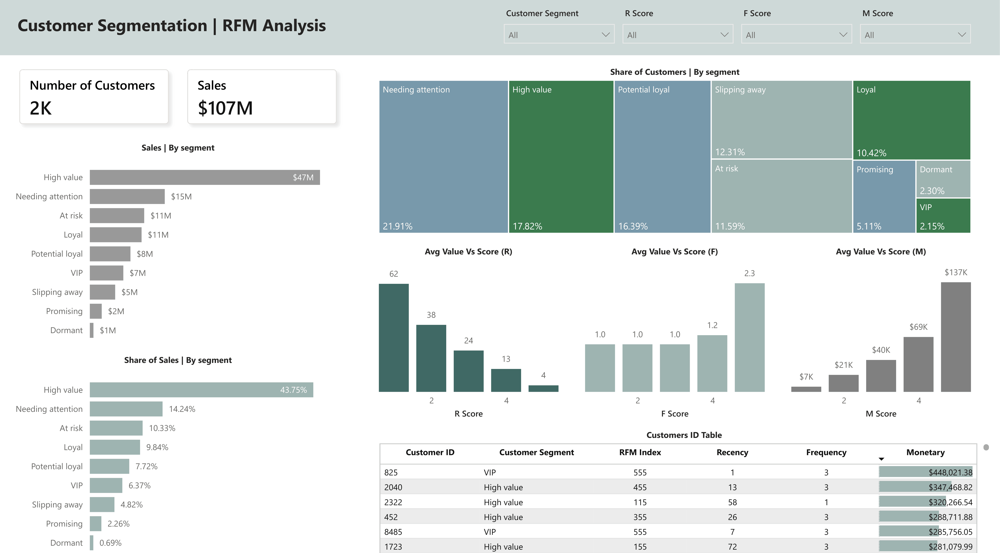

# 📊 Customer Segmentation Project | RFM Analysis

 

## 🔗 Project Resources
* [**Live Interactive Dashboard**](https://app.powerbi.com/view?r=eyJrIjoiODMwOThkZGUtY2JjZC00ZWIwLWJkNjMtMzM0YTI2NDNmMjc5IiwidCI6IjY2ZmViZjA0LTBjNWMtNGYwMi1hMzA2LTM3OTFlYjIyNWNhNSJ9) 🚀
* [**Power BI Desktop File (.pbix)**](./dashboard/RFM_Analysis_Dashboard.pbix)
* [**SQL Data Transformation Script**](./sql/rfm_segmentation.sql)
* [**Processed Dataset (CSV)**](./data/RFM_Analysis_Data.csv)

 

## 📌 Business Case Overview
The objective of this project is to analyze the transaction history of **2,000 customers** with a total revenue of **$107M**. By implementing **RFM Analysis** (Recency, Frequency, Monetary), I segmented the audience into distinct groups to help the marketing team move away from "one-size-fits-all" communication toward data-driven personalization.

 

## 🖼 Dashboard Preview

 

## 📈 Key Business Insights (Data-Driven)

After analyzing the customer base, several critical business patterns were identified:

1. **High-Value Concentration (Pareto Effect):**
   * **Insight:** The **High Value** segment (17.82% of customers) generates **43.75% ($47M)** of total revenue. 
   * **Risk:** The business is highly dependent on a small group. A loss of even 5% of these customers would result in a ~$2.3M revenue drop.

2. **The "Silent" Majority (Needing Attention):**
   * **Insight:** The largest group of customers is **Needing Attention (21.91%)**. 
   * **Opportunity:** This segment has high historical value but is beginning to lapse. They are the primary source for "quick wins" in revenue growth.

3. **Churn Exposure:**
   * **Insight:** Over **$16M** of revenue is tied to **At Risk** and **Slipping Away** segments.
   * **Observation:** The average monetary value of an "At Risk" customer remains high, meaning these were once valuable clients that the business failed to retain.

 

## 🔍 Scoring Legend & Model Validation
The scoring system ranks customers from **1 (Lowest)** to **5 (Highest)** for each metric. Validation shows clear behavioral differentiation:

| Score | Recency (Avg. days since last purchase) | Frequency (Avg. number of orders) | Monetary (Avg. Customer Value) |
| :--- | :--- | :--- | :--- |
| **5** | **3.7 days** (Active) | **2.3 orders** (Frequent) | **$137K** (Top Spender) |
| **4** | **13.0 days** | **1.2 orders** | **$69K** |
| **3** | **24.0 days** (Stable) | **1.0 order** (Occasional) | **$40K** (Average) |
| **2** | **38.0 days** | **1.0 order** | **$21K** |
| **1** | **62.0 days** (Inactive) | **1.0 order** (Single-timer) | **$7K** (Low Value) |

 

## 💡 Strategic Business Recommendations

### 🚀 1. VIP & High Value: "The Platinum Treatment"
* **Target:** RFM Scores 555, 455.
* **Strategy:** Implement a loyalty program with personal concierge services and exclusive "First Look" access to new products.
* **Goal:** Maximize retention and LTV (Lifetime Value).

### 🔄 2. Needing Attention: "The Reactivation Push"
* **Target:** High historical spenders with declining Recency.
* **Strategy:** Deploy limited-time offers (48-hour discounts) or personalized "We Miss You" bundles.
* **Goal:** Re-activate before they migrate to "At Risk" status.

### 🛠 3. Potential Loyal: "The Habit Builder"
* **Target:** High Recency but Mid Frequency.
* **Action:** Offer incentives for the 2nd and 3rd purchases (e.g., "Buy 3, Get 1 Free").
* **Goal:** Increase purchase frequency and move them into the "Loyal" segment.

### 🛑 4. At Risk: "The Win-Back Survey"
* **Target:** Customers who haven't purchased in >40 days.
* **Action:** Send a satisfaction survey with a high-value discount (30%+) to understand churn reasons.
* **Goal:** Final attempt at retention for high-Monetary clients.

 

## 🛠 Tech Stack Details
* **SQL:** Advanced data manipulation using **`NTILE()` window functions** to rank customers and group data into logical segments.
* **Power BI:** Built a dynamic UI with cross-filtering and custom visual layouts.
* **DAX:** Developed measures for **% Share of Sales**, **Average Value vs Score**, and **RFM Index**.

 

## ⚙️ Data Pipeline & Methodology
A key feature of this project is the **SQL-first approach**:
1. **Engine:** All heavy data lifting, including Recency, Frequency, and Monetary calculations, was performed using **SQL**.
2. **Logic:** I used Window Functions (`NTILE`) to ensure that scoring logic is centralized and easily scalable.
3. **Power BI Role:** The BI tool was used exclusively for **UI/UX and storytelling**. It imports a pre-calculated, clean dataset, which ensures high performance and consistency of metrics.

*This approach demonstrates my ability to handle large datasets where performing complex calculations directly in the BI tool would be inefficient.*

 

## 📂 Project Structure
* `/dashboard/`: Power BI report file (`.pbix`).
* `/data/`: Processed CSV dataset.
* `/img/`: Screenshots and visual assets.
* `/sql/`: SQL scripts for data transformation.

 

**Project by: Vitali Kandrashou**  
*Data Analyst | SQL & Python Specialist*
